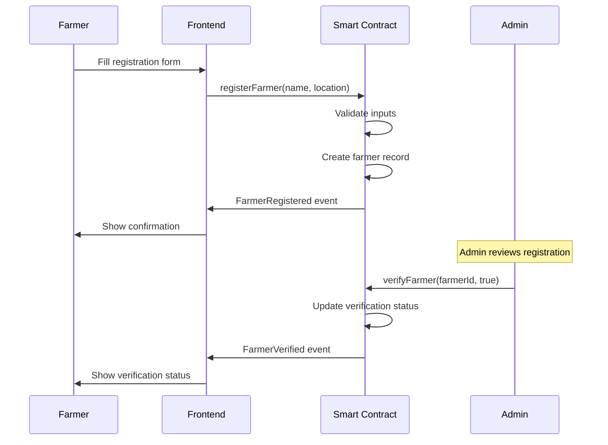
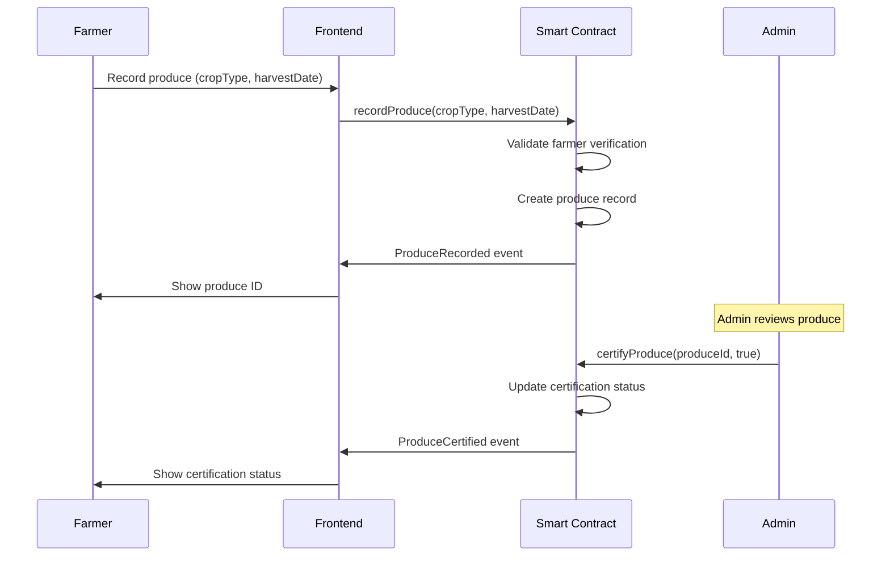

# 🏗️ AgroSafe Architecture Documentation

## Table of Contents

1. [System Overview](#system-overview)
2. [Architecture Diagram](#architecture-diagram)
3. [Component Overview](#component-overview)
4. [Data Flow](#data-flow)
5. [Smart Contract Architecture](#smart-contract-architecture)
6. [Frontend Architecture](#frontend-architecture)
7. [Security Architecture](#security-architecture)
8. [Database Schema](#database-schema)
9. [API Design](#api-design)
10. [Deployment Architecture](#deployment-architecture)

## System Overview

AgroSafe is a decentralized agricultural traceability platform built on blockchain technology. The system enables transparent tracking of agricultural products from farm to consumer, ensuring food safety and supply chain integrity through immutable record keeping.

### Key Objectives

- **Traceability**: Complete supply chain visibility
- **Transparency**: Immutable records accessible to all stakeholders  
- **Security**: Robust protection against fraud and tampering
- **Scalability**: Efficient data management for large-scale operations
- **Accessibility**: User-friendly interface for farmers and consumers

## Architecture Diagram

```
┌─────────────────────────────────────────────────────────────────┐
│                        Frontend Layer                           │
├─────────────────────────────────────────────────────────────────┤
│  ┌─────────────┐  ┌─────────────┐  ┌─────────────┐              │
│  │  Dashboard  │  │   Farmer    │  │    Admin    │              │
│  │   Page      │  │   Portal    │  │   Panel     │              │
│  └─────────────┘  └─────────────┘  └─────────────┘              │
│                                                                 │
│  ┌─────────────┐  ┌─────────────┐  ┌─────────────┐              │
│  │   Web3      │  │    Hooks    │  │ Components  │              │
│  │ Provider    │  │   & Utils   │  │   & UI      │              │
│  └─────────────┘  └─────────────┘  └─────────────┘              │
└─────────────────────────────────────────────────────────────────┘
                                  │
                                  ▼
┌─────────────────────────────────────────────────────────────────┐
│                     Blockchain Layer                            │
├─────────────────────────────────────────────────────────────────┤
│                                                                 │
│              ┌─────────────────────────────┐                     │
│              │     AgroSafe.sol            │                     │
│              │   (Smart Contract)          │                     │
│              └─────────────────────────────┘                     │
│                                                                 │
│  ┌─────────────┐  ┌─────────────┐  ┌─────────────┐              │
│  │ Farmer      │  │  Produce    │  │  Events &   │              │
│  │ Registry    │  │ Records     │  │  Logging    │              │
│  └─────────────┘  └─────────────┘  └─────────────┘              │
│                                                                 │
└─────────────────────────────────────────────────────────────────┘
                                  │
                                  ▼
┌─────────────────────────────────────────────────────────────────┐
│                    Blockchain Network                           │
├─────────────────────────────────────────────────────────────────┤
│                                                                 │
│  ┌─────────────────────────────────────────────────────────────┐ │
│  │                Ethereum Network                             │ │
│  │  • Immutable transaction history                            │ │
│  │  • Smart contract execution                                 │ │
│  │  • Consensus mechanism                                      │ │
│  │  • Cryptographic security                                   │ │
│  └─────────────────────────────────────────────────────────────┘ │
│                                                                 │
└─────────────────────────────────────────────────────────────────┘
```

## Component Overview

### 1. Smart Contract Layer

**AgroSafe.sol** - Core smart contract managing:
- Farmer registration and verification
- Produce recording and certification
- Access control and security
- Event emission for frontend integration

### 2. Frontend Layer

**React Application** providing:
- User interface for farmers and administrators
- Web3 wallet integration
- Real-time data display
- Form handling and validation

### 3. Blockchain Network

**Ethereum Network** providing:
- Immutable data storage
- Consensus mechanism
- Transaction finality
- Cryptographic security

## Data Flow

### Farmer Registration Flow



### Produce Recording Flow



## Smart Contract Architecture

### Contract Structure

```
AgroSafe
├── State Variables
│   ├── Constants (validation limits)
│   ├── Counters (auto-incrementing IDs)
│   └── Mappings (data storage)
├── Structs
│   ├── Farmer (registration data)
│   └── Produce (product information)
├── Modifiers
│   ├── Access control (onlyOwner)
│   ├── Security (nonReentrant, whenNotPaused)
│   └── Validation (input sanitization)
├── Functions
│   ├── Farmer management
│   ├── Produce management
│   └── Data retrieval
└── Events
    ├── FarmerRegistered
    ├── FarmerVerified
    ├── ProduceRecorded
    └── ProduceCertified
```

### Security Patterns

1. **Reentrancy Protection**
   - All state-changing functions use `nonReentrant` modifier
   - Prevents recursive calls and reentrancy attacks

2. **Access Control**
   - Owner-only functions for critical operations
   - Farmer verification requirement for produce recording
   - Input validation for all public functions

3. **Emergency Controls**
   - Pausable contract for emergency stops
   - Only owner can pause/unpause operations

4. **Error Handling**
   - Custom errors for gas-efficient reverts
   - Detailed error messages for debugging
   - Input validation with specific error types

## Frontend Architecture

### Component Structure

```
src/
├── components/          # Reusable UI components
│   ├── Card.tsx        # Generic card component
│   ├── ConnectButton.tsx # Wallet connection
│   ├── Loading.tsx     # Loading states
│   ├── Navbar.tsx      # Navigation bar
│   └── WalletConnect.tsx # Wallet management
├── hooks/              # Custom React hooks
│   ├── useAgroSafe.ts  # Contract interaction
│   ├── useWallet.ts    # Wallet management
│   └── useAgroSafe.tsx # Alternative contract hook
├── pages/              # Page components
│   ├── Admin.tsx       # Admin dashboard
│   ├── Dashboard.tsx   # Main dashboard
│   ├── FarmerRegister.tsx # Registration form
│   ├── Produce.tsx     # Produce management
│   └── Trace.tsx       # Traceability view
├── providers/          # Context providers
│   ├── WagmiReownProvider.tsx # Web3 provider
│   └── Web3Provider.tsx # Web3 context
└── abi/               # Contract ABIs
    └── AgroSafe.json  # Contract interface
```

### State Management

- **Local State**: React useState for component-specific data
- **Global State**: Context API for Web3 connection state
- **Blockchain State**: Real-time updates via event listeners

### Web3 Integration

1. **Wallet Connection**
   - MetaMask and compatible wallet support
   - Automatic network detection and switching
   - Account change handling

2. **Contract Interaction**
   - ABI-based function calls
   - Event listening for real-time updates
   - Transaction status monitoring

## Security Architecture

### Smart Contract Security

1. **Input Validation**
   - String length validation
   - Date format validation
   - Address validation (non-zero checks)

2. **Access Control**
   - Role-based permissions
   - Verification requirements
   - Owner-only administrative functions

3. **Protection Mechanisms**
   - Reentrancy guards
   - Pausable emergency stops
   - Overflow protection (Solidity 0.8+)

### Frontend Security

1. **Wallet Security**
   - No private key storage
   - User-controlled transaction signing
   - Network verification

2. **Data Validation**
   - Client-side input validation
   - Server-side validation (if applicable)
   - XSS protection

### Network Security

1. **Transaction Security**
   - Gas limit protection
   - Revert handling
   - Timeout management

2. **RPC Security**
   - Multiple RPC endpoint support
   - Rate limiting considerations
   - API key protection

## Database Schema

### Blockchain Storage

The smart contract uses the following data structures:

```solidity
// Farmer Structure
struct Farmer {
    uint256 id;           // Unique identifier
    string name;          // Farmer name (2-100 chars)
    address wallet;       // Ethereum address
    string location;      // Location (3-200 chars)
    bool verified;        // Verification status
}

// Produce Structure  
struct Produce {
    uint256 id;           // Unique identifier
    uint256 farmerId;     // Link to farmer
    string cropType;      // Crop type (2-50 chars)
    string harvestDate;   // Harvest date (YYYY-MM-DD)
    bool certified;       // Certification status
}
```

### Data Relationships

```
Farmers (1) ──→ (M) Produce Records
    │
    └── One farmer can have multiple produce records
    └── Each produce record belongs to one farmer

Events track all state changes for frontend synchronization
```

### Storage Efficiency

- **Mappings**: O(1) access for data retrieval
- **Auto-incrementing IDs**: Sequential unique identifiers
- **Pagination**: Efficient large dataset handling
- **Events**: Historical data access via blockchain logs

## API Design

### Smart Contract Interface

The contract provides the following public interface:

#### Farmer Management
```solidity
// Registration
function registerFarmer(string name, string location) external

// Verification (admin only)
function verifyFarmer(uint256 farmerId, bool status) external

// Data retrieval
function getFarmersPaginated(uint256 offset, uint256 limit) external view returns (Farmer[] memory)
function totalFarmers() external view returns (uint256)
```

#### Produce Management
```solidity
// Recording (verified farmers only)
function recordProduce(string cropType, string harvestDate) external returns (uint256)

// Certification (admin only)
function certifyProduce(uint256 produceId, bool certified) external

// Data retrieval
function getProducePaginated(uint256 offset, uint256 limit) external view returns (Produce[] memory)
function getProduceByFarmerPaginated(uint256 farmerId, uint256 offset, uint256 limit) external view returns (Produce[] memory)
function totalProduce() external view returns (uint256)
```

#### Administrative
```solidity
// Emergency controls
function pause() external onlyOwner
function unpause() external onlyOwner
```

### Event System

The contract emits events for all significant state changes:

- `FarmerRegistered(id, name, wallet)`
- `FarmerVerified(id, status)`
- `ProduceRecorded(id, farmerId, cropType)`
- `ProduceCertified(id, certified)`

## Deployment Architecture

### Development Environment

```
Local Development
├── Foundry (Smart Contracts)
│   ├── forge build     # Compile contracts
│   ├── forge test      # Run tests
│   └── forge deploy    # Local deployment
└── Vite (Frontend)
    ├── npm run dev     # Development server
    ├── npm run build   # Production build
    └── npm run preview # Preview build
```

### Testnet Deployment

```
Sepolia Testnet
├── Contract Deployment
│   ├── forge script Deploy.s.sol
│   ├── RPC endpoint via Alchemy/Infura
│   └── Private key management
├── Frontend Deployment
│   ├── Vercel/Netlify
│   ├── Environment variables
│   └── Contract address configuration
└── Verification
    ├── Etherscan verification
    └── Frontend testing
```

### Mainnet Deployment

```
Ethereum Mainnet
├── Contract Deployment
│   ├── Gas optimization
│   ├── Multi-signature wallet
│   └── Upgrade planning
├── Frontend Deployment
│   ├── CDN distribution
│   ├── Domain configuration
│   └── Analytics integration
└── Monitoring
    ├── Contract monitoring
    ├── Transaction tracking
    └── Performance metrics
```

### Infrastructure Considerations

1. **Scalability**
   - Pagination for large datasets
   - Event filtering for efficient queries
   - Batch operations where applicable

2. **Reliability**
   - Multiple RPC provider support
   - Fallback mechanisms
   - Error handling and recovery

3. **Monitoring**
   - Transaction success tracking
   - Error rate monitoring
   - Performance metrics

4. **Maintenance**
   - Upgradable contract patterns (future)
   - Database archival strategies
   - Long-term data preservation

---

This architecture documentation provides a comprehensive overview of the AgroSafe system design. For implementation details, refer to the inline code documentation and API references.